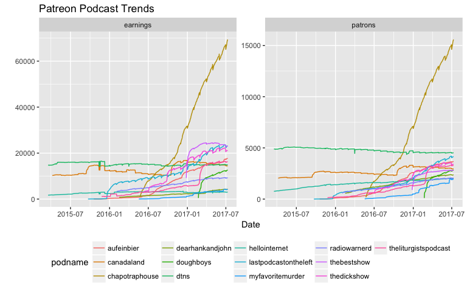
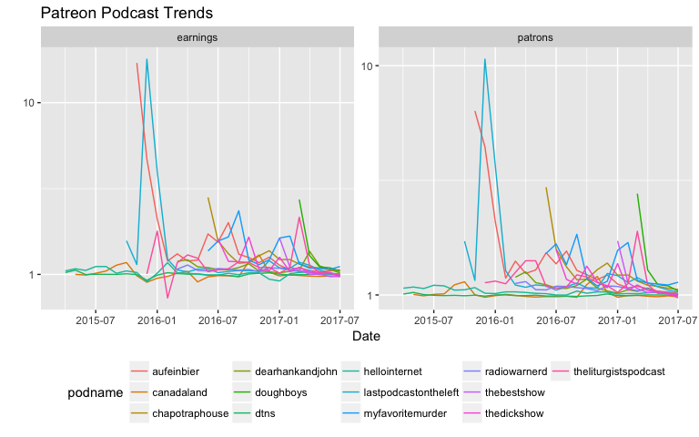

Towards Listener Analysis for Podcasts
================
Chris Hua
10 July 2017

Podcasts
--------

You know what podcasts are, and you are probably even aware of how podcasts are taking over content distribution on the web. The best take I've found is from [Ben Thompson of Stratechery](https://stratechery.com/2017/podcasts-analytics-and-centralization/), and, in fact, from his [podcast](http://exponent.fm/episode-118-podcasting-and-centralization/). If you haven't listened to it or read it, go do that now! I'll still be here.

I'm a big believer in podcasts - I think they can be a sustainable source of income for content creators. Most of the most popular podcasts are currently advertising supported. Notably, Bill Simmons's [Ringer](https://theringer.com/the-ringer-podcast-network-78792908eaff), aka The Ghost Of Grantland, is apparently fully supported by their podcasts, of which they probably have too many. These large corporate podcast makers (The Ringer is affiliated with HBO) have the broad audience access to draw large advertisers from a variety of industries. Further, broadly speaking, their content is relatively inoffensive and thus highly amenable to corporate interests.

These milquetoast sensibilities are just extensions of the existing mainstream media. Remember that Simmons was [fired from ESPN](http://www.vanityfair.com/news/2015/05/what-doomed-bill-simmons-at-espn), at least in part, for making 'disparaging' (and correct) comments about Roger Goodell, threatening ESPN's relationship with the NFL. In a media environment where Simmons and his staff are beholden to HBO's advertisers, can they really have editorial freedom with their podcasts, a medium which should have more of an 'everyman' appeal? Of course not. And conflicts of interests in journalism are nothing new - Chomsky's famous *[Manufacturing Consent](https://en.wikipedia.org/wiki/Manufacturing_Consent)* is almost 30 years old now. However, the inherent virality in podcast distribution enables a new, similarly viral, method for funding podcasts via listener donations.

In this paper/post, we outline some of the funding models of these listener-supported podcasts, investigate some apparent trends, and present a framework for further study of podcast funding.

Data
----

For this analysis, we use data about podcasts hosted on [Patreon](https://patreon.com), a leading platform for content creators to earninteract with contributors. Typically, users will 'subscribe' to a podcast, paying some amount of money each month in return for subscriber-only links to 'premium' episodes. Some podcasts will have multiple tiers for how much contributors can pay, while others have just one tier. Furthermore, even if a podcast only has a $5 subscriber tier, subscribers can choose to donate more or less, though those who donate less do not get the subscriber benefits and those who donate more do not get extra economic benefits. Additionally, some podcasts do not offer additional episodes for subscribing, but may offer other benefits or just the satisfaction of supporting good content.

We are able to scrape data that includes the number of subscribers and the total earnings for a podcast, at a daily level. In some cases, the creators do not make public their monthly earnings, and these are excluded from revenue analysis.

We censor the data into weekly data from daily data, by taking the weekly average of each statistic. This means that when we say growth, we mean 'week-over-week' growth. In general, the data is pretty smooth on a daily level.

Metrics
-------

Typically, in tech data science, we create key metrics as proxies for 'success.' With the available data, I've pinpointed a few interesting metrics that could justifiably explain important behavior.

-   Earnings per month, and patrons per month: the obvious ones
-   Earnings growth, and patron growth: the typical measures of growth.
-   Earnings per patron: measures average patron engagement - ideally we could differentiate the impact of new vs old listeners here.

These are some of the metrics inferrable from public data. With more granular data, e.g. who subscribes and when do they unsubscribe, we could create more sophisticated models of listener behavior, a la [Fader, Hardie, Lee 2005](http://journals.ama.org/doi/abs/10.1509/jmkr.2005.42.4.415?code=amma-site). This analysis has a difficult time dealing with the heterogeneity present in listeners, since they are mostly treated the same in the data. Further research is warranted in applying these established marketing methods to understand podcast growth and listener behavior.

Analysis
--------

We scraped data corresponding to 13 of the top 20 podcasts on Patreon.

The overall trends are shown below. The huge climber is Chapo Trap House.

We can do the same for the change in these metrics, i.e. growth.

Here, we show month over month results, using the monthly average and calculating the month over month results.

    ## Warning: Removed 13 rows containing missing values (geom_path).

